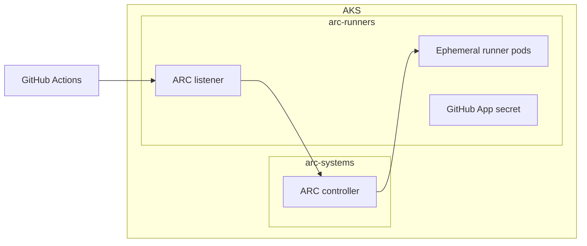

## Architecture

Two Terraform root modules separate infrastructure from runner configuration.
The `infra` module deploys AKS. The `arc-runners` module reads the AKS outputs
from the infra state and deploys the GitHub Actions Runner Controller (ARC) and
one ephemeral runner scale set.

```text
.
|-- infra/
|   `-- aks.tf
`-- arc-runners/
  |-- arc-controller.tf
  `-- runners.tf
```



The controller and runner workloads use separate namespaces, following GitHub's
security recommendation. Runner pods execute arbitrary workflow code, so this
AKS cluster should not share nodes with sensitive production workloads.

## Prerequisites

* Terraform 1.6 or later
* Azure CLI authenticated with `az login`
* An Azure subscription where you can create a resource group and AKS cluster
* A GitHub organization-owned GitHub App installed in the target organization

Configure the GitHub App with these permissions:

* Organization `Self-hosted runners`: read and write
* Repository `Metadata`: read-only
* Repository `Administration`: read and write only for repository-scoped runners

## Configure

Update Azure deployment values in `infra/terraform.auto.tfvars`. Set
`github_config_url`, the GitHub App IDs, and infrastructure state settings in
`arc-runners/terraform.auto.tfvars`.

Keep the GitHub App private key out of files and shell history. In PowerShell,
load it into a sensitive Terraform environment variable:

```powershell
$env:TF_VAR_github_app_private_key = Get-Content -Raw "C:\secure\arc-app.private-key.pem"
```

> [!IMPORTANT]
> Terraform stores the GitHub App private key in state because it creates the
> Kubernetes secret. Use an encrypted remote backend with restricted access for
> shared or production deployments. Local state and `terraform.tfvars` are
> excluded by `.gitignore`.

Runner pods pull the official GitHub Actions runner image from GitHub Container
Registry by default: `ghcr.io/actions/actions-runner:latest`. No ACR or image
pull secret is required. Set `runner_image` to another full public image
reference when needed.

The official image contains the runner runtime rather than the full software
set available on GitHub-hosted runners. Install workflow-specific tools through
setup actions or workflow steps. Set `runner_container_mode = "dind"` only when
workflows require Docker actions or container jobs. Docker-in-Docker requires
privileged runner pods.

## Deploy

Format, initialize, validate, review, and apply the configuration:

```powershell
terraform -chdir=infra fmt
terraform -chdir=infra init
terraform -chdir=infra validate
terraform -chdir=infra plan -out infra.tfplan
terraform -chdir=infra apply infra.tfplan
```

The first apply can take 10 to 20 minutes while Azure creates AKS.

Deploy ARC after AKS is available:

```powershell
terraform -chdir=arc-runners fmt
terraform -chdir=arc-runners init
terraform -chdir=arc-runners validate
terraform -chdir=arc-runners plan -out arc-runners.tfplan
terraform -chdir=arc-runners apply arc-runners.tfplan
```

## GitHub Actions pipelines

Two manually triggered workflows separate infrastructure and runner
deployments:

| Workflow | Purpose |
|----------|---------|
| `Deploy AKS infrastructure` | Creates AKS |
| `Deploy ARC controller and runners` | Deploys or updates the controller and runner scale set |

Run the workflows in that order. The ARC workflow pulls the official public
runner image configured in `arc-runners/terraform.auto.tfvars`.

Configure these Terraform variables in `arc-runners/terraform.auto.tfvars`:

| Variable | Example |
|----------|---------|
| `github_config_url` | `https://github.com/example-org` |
| `github_app_id` | `123456` |
| `github_app_installation_id` | `12345678` |
| `runner_image` | `ghcr.io/actions/actions-runner:latest` |

Configure these GitHub Actions repository variables:

| Variable | Example |
|----------|---------|
| `TF_STATE_RESOURCE_GROUP` | `terraform-state-rg` |
| `TF_STATE_STORAGE_ACCOUNT` | `myteamtfstate` |
| `TF_STATE_CONTAINER` | `tfstate` |
| `INFRA_TF_STATE_KEY` | `arc/dev/infra.tfstate` |
| `ARC_RUNNERS_TF_STATE_KEY` | `arc/dev/runners.tfstate` |

Configure these GitHub Actions repository secrets:

* `AZURE_CLIENT_ID`
* `AZURE_CLIENT_SECRET`
* `AZURE_TENANT_ID`
* `AZURE_SUBSCRIPTION_ID`
* `ARC_GITHUB_APP_PRIVATE_KEY`

Grant the service principal the minimum permissions required by your scope and
rotate its client secret regularly. The workflows require permission to manage
the deployment resources and access the state blob. Typical built-in roles are
`Contributor` and `Storage Blob Data Contributor` at their corresponding
scopes. Migrate to GitHub OIDC and a federated identity credential when the
temporary client-secret setup is no longer needed.

The state resource group, storage account, and blob container must exist before
the first Terraform workflow runs. The `infra` and `arc-runners` roots use
separate state blobs. The runner root reads the infra outputs to locate AKS and
does not own the cluster.

> [!IMPORTANT]
> The root-level local Terraform state is retained because it may represent
> deployed resources. Before running either workflow, migrate existing state so
> Azure resources are in `INFRA_TF_STATE_KEY`, while the controller, namespaces,
> GitHub secret, and runner Helm release are in `ARC_RUNNERS_TF_STATE_KEY`.
> Starting with empty or incorrectly split states can make Terraform attempt to
> recreate resources that already exist.

## Verify

Configure `kubectl` and inspect the ARC workloads:

```powershell
az aks get-credentials `
  --resource-group (terraform -chdir=infra output -raw resource_group_name) `
  --name (terraform -chdir=infra output -raw aks_cluster_name) `
  --overwrite-existing

kubectl get pods -n (terraform -chdir=arc-runners output -raw arc_controller_namespace)
kubectl get pods -n (terraform -chdir=arc-runners output -raw arc_runner_namespace)
helm list --all-namespaces
```

Use the value from
`terraform -chdir=arc-runners output -raw runner_scale_set_name` in a workflow:

```yaml
jobs:
  build:
    runs-on: arc-runner-set
    steps:
      - uses: actions/checkout@v4
      - run: echo "Running on AKS"
```

## Inputs

The commonly changed inputs are:

| Input                   | Default                                    | Purpose                               |
|-------------------------|--------------------------------------------|---------------------------------------|
| `location`              | `southeastasia`                            | Azure deployment region               |
| `node_vm_size`          | `Standard_D4ds_v5`                         | Default node pool VM size             |
| `node_min_count`        | `1`                                        | Minimum AKS node count                |
| `node_max_count`        | `3`                                        | Maximum AKS node count                |
| `arc_chart_version`     | `0.12.1`                                   | Pinned ARC Helm chart version         |
| `min_runners`           | `0`                                        | Warm idle runners                     |
| `max_runners`           | `10`                                       | Runner concurrency limit              |
| `runner_image`          | `ghcr.io/actions/actions-runner:latest`    | Full runner image reference           |
| `runner_container_mode` | `null`                                     | Optional ARC container execution mode |

## Destroy

The AzureRM provider protects a non-empty resource group from accidental
deletion. Destroy child resources first, then run destroy again if Terraform
reports that the resource group still contains Azure-managed resources.

```powershell
terraform -chdir=arc-runners destroy
terraform -chdir=infra destroy
```

ARC chart upgrades can include custom resource definition changes that Helm
cannot update in place. Review the GitHub ARC upgrade guidance before changing
`arc_chart_version`.# aks-arc-runners
